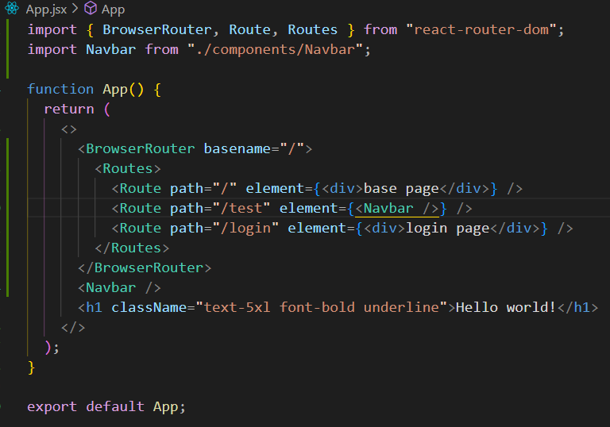
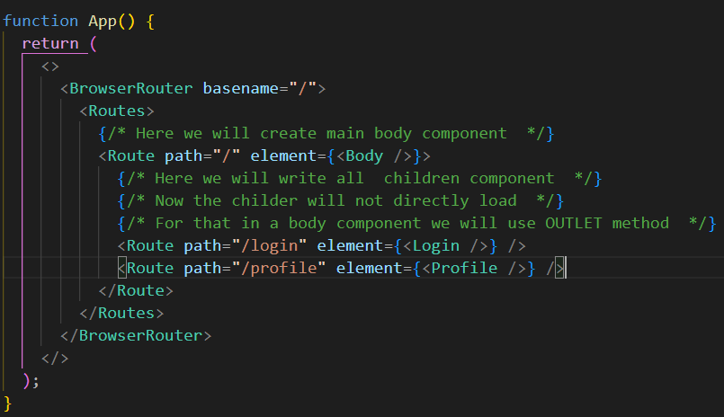
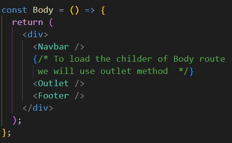

# Setting up a Frontend Project

- Go to tailwind - FRAMEWORK > vite - copy paste the instruction in terminal

# DaisyUI

- We will be using external library to make the UI
- Go to installation section in DaisyUI
- npm i daisyUi > in tailwind.config.js paste plugins
- To test DaisyUI search navbar - paste in app.js
- Will create seprate components (file and folder) for seprate components
- src > component > Navbar.jsx

# React-Router-DOM

- install react router dom
- In app.jsx follow the following code
- 
- We will structure our frontend (app.jsx)
- First mainly we will have Body component > then inside its different routes
- App.jsx will be
- 
- Body.jsx
- 
